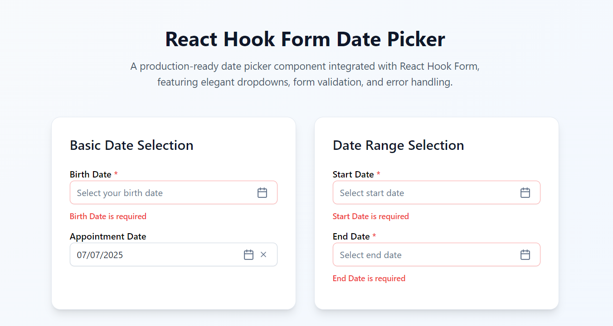

Here’s your updated `README.md` with the following improvements:

* ✅ **npm badge**
* ✅ **npm install instructions**
* ✅ **npm + GitHub links**
* ✅ Clean formatting with a professional open-source look

---


# React Hook Form DatePicker

[](https://www.npmjs.com/package/react-hook-form-datepicker)

A beautiful, production-ready Date Picker component for React, built with [React Hook Form](https://react-hook-form.com/), [Tailwind CSS](https://tailwindcss.com/), and [Lucide React](https://lucide.dev/icons/).

This component supports year/month dropdowns, calendar selection, form validation, error handling, and seamless integration with React Hook Form.

---

## 🚀 Features

- ✅ **Form Validation** – Integrated with React Hook Form
- ✅ **Controller Support** – Use with RHF's Controller API
- ✅ **Error Handling** – Auto error display with Tailwind styling
- ✅ **Required Fields** – Shows required label and error state
- ✅ **Clearable** – Option to allow clearing selected date
- ✅ **Date Constraints** – Min and max date range support
- ✅ **Modern UI** – Beautiful, accessible design

---

## 📦 Install via npm

```bash
npm install react-hook-form-datepicker
````

---

## 🧪 Demo



---

## 🧑‍💻 Usage

```tsx
import { useForm } from 'react-hook-form';
import DatePicker from 'react-hook-form-datepicker';

function MyForm() {
  const { control, handleSubmit } = useForm();

  return (
    <form onSubmit={handleSubmit((data) => console.log(data))}>
      <DatePicker
        control={control}
        inputName="myDate"
        label="Select Date"
        required={true}
        isClearable={true}
        minDate={new Date()}
        maxDate={new Date(2030, 11, 31)}
      />
      <button type="submit">Submit</button>
    </form>
  );
}
```

---

## 🔧 Props

See [`DatePickerProps`](src/types/datepicker.types.ts) for a full list of supported props.

---

## 🎨 Customization

* ✨ **Date Format**: Customize as `dd/mm/yyyy`, `mm/dd/yyyy`, `yyyy-mm-dd`
* 🖌️ **Tailwind Classes**: Easily style with Tailwind
* 🔧 **Icon Support**: Uses [Lucide React](https://lucide.dev/) icons

---

## 📄 License

This project is licensed under the [MIT License](LICENSE).

---

> Built with ❤️ using React, Tailwind CSS, and React Hook Form.

---

### 🔗 Useful Links

* 🔸 **npm Package**: [https://www.npmjs.com/package/react-hook-form-datepicker](https://www.npmjs.com/package/react-hook-form-datepicker)
* 🔸 **GitHub Repo**: [https://github.com/ahmerali1813/react-hook-form-datepicker](https://github.com/ahmerali1813/react-hook-form-datepicker)

```

---

Let me know if you'd like a version with **shields.io GitHub stats**, or automatic **API prop table generation** using tools like `react-docgen`.
```
